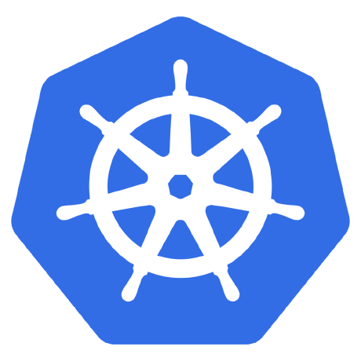

# Kubernetes 入门文章集

这是个人学习 Kubernets 的一系列总结文章。

 

## 从 Docker 谈起

从 15 年开始， 容器就开始成为最火的名词，Docker 就是容器的代名词。

这也激发了应用架构的一次变革，从单体架构，向微服务架构转移。

而到了 2017 年，最惨科技公司排行最靠前的竟然是这家公司，这恰好也说明了一件事，容器已经到达了顶峰，未来的架构会在其它的方向进行大的发展。

[详情](docker.md)

 

## 为什么是 Kubernets

谈起 Kubernets，还是要再回看头下 Docker，它作为容器，只解决了应用运行时的问题，但应用的编排和网络的问题，以及容器的共享存储，都没有很好的方案。

而这恰恰就是 Kubernetes 所要做的。

 

## 基础组件 Components

本章中，我们来了解下 Kubernetes 由哪些部分来组成的。

Kubernetes 中，机器被分为两种类型，Master / Node(Worker) 。

Master 和 Node 各自有各自的组件来工作。

* https://kubernetes.io/docs/concepts/overview/components

### 🔅 Master

Master 不是由选举而产生的，而是初始设定的。

> Master 也能同时做为一个 Node 参于应用的运行调度，这里暂不涉及。

Master 只在调度时有用，当 Worker 都正常工作且没有新的调度工作时，Master 下线是不受影响的。

Master 通常由以下四个组件构成：

* etcd
* kube-apiserver
* kube-scheduler
* kube-controller-manager

#### etcd

etcd 是整个系统的存储单元，所有的信息都被储存在这里。可以简单的理解为一个高可用的 `key:value` 数据库。

[详情](etcd.md)

#### kube-apiserver

提供一整套的对外 RESTful 接口，用于操作和查看事项。

#### kube-scheduler

任务来时，进行调度的工具，像分配任务到哪一台 Node 上。

#### kube-controller-manager

ControllerManager 会在下面单独介绍。

### 🔅 Node

Node 被设计为只用来跑应用容器，所以上面必须要有容器的组件，也就是 Docker。除此之外还会有两样必备的东西，那就是 kubelet 和 kube-proxy。

#### kubelet

kubelet 用于接收 Master 分配到的信息，并进行执行。同时也会将 Worker 上的信息同步给 Master，然后存储到 etcd 中。

#### kube-proxy

kube-proxy 是一个很重要的组件，用于网络。它的功能就是从 master 上拉下来信息，然后更新本机的 iptables 规则，让网络可达。

这部分会在网络部分更多提及。

### 🔅 kubectl

kubectl 是一个命令行工具，用来操作 Kubernetes 的，它可以在任何一台机器上执行。

 

## 概念 / Concepts

Kubernets 解决了很多的问题，但也提出了很多的概念。它可比 Docker 要复杂的多。

### 🔅 Pod

Kubernetes 在容器的概念上又进行了一次封装，叫 Pod，它认为单的的容器不能很好的完成一些指定的工作。而 Pod 则可以把多个容器放在一起进行调度，在同一个 Pod 间的容器可以更好的通讯。

[详情](pod.md)

### 🔅 Service

Pod 是动态的，它是 Kubernetes 扩容缩容的调度单位，不能直接对外提供，所以在外层做了一个 Proxy，这个 Proxy 就是 Service，Service 有对外提供服务的能力。

Service 对外提供服务有三种形式

- NodePort
- Ingress
- LoadBlance

关于 Service 和这几跟上形式的更多信息，请见：[详情](service.md)

### 🔅 Ingress

虽然 Service 能通过 NodePort 对外提供服务，但需要手动配置端口，服务多起来的话，会成为一个新的瓶颈，这时，我们可以通过一个新的组件 Ingress 来解决了。

Ingress 相对于 NodePort 比较复杂，我们单独拿出来讲一下：

[详情](ingress.md)

### 🔅 Deployment

如何发布一个 启动一个 Pod 呢？有很多种方法，可以单独的发布 Pod，也可以由 ReplicaSet 进行。也可以用 Deployment 的方式。

这是最推荐的方式。

[详情](deployment.md)

### 🔅 对象

对象是 Kubernetes 中的一个概念，它把所有的东西都定义为对象，对象有两种状态，一种是定义的，一种是实际的。

> 这有点像 FLUX 的单向数据流，永远只操作数据，然后页面会改变和数据保持一致。

> Controller Manager 就是把这两种状态进行校正的的后台服务。

关于 Object 的更多介绍，参见 [详情](object.md)

### 🔅 Controller Manager

上面介绍了这些概念，它们是怎么运转的呢？

它们是由 Controller Manager 来进行执行的。

常见的 Controller Manager 有：

- Node Controller
- Replication Controller
- Endpoints Controller
- Service Account & Token Controllers

[详情](controller.md)

 

## 网络 / Network

网络是 Kubernetes 的基石，没有网络，就没有 Kubernetes 的一切。

### 🔅 CNI

[详情](cni.md)

### 常用的网络组见：

#### - Flannel

[详情](flannel.md)

#### - Calico

[详情](calico.md)

### 🔅 kube-proxy

 

## 安全

### 🔅 Account 

[详情](account.md)

### 🔅 RBAC

[详情](rbac.md)

### 🔅 Service Account

[详情](service-account.md)

 

## 存储

 

## Other

### 🔅 Dashboard

Kubernetes 提供了一个好的方式来查看当前的状态。就是 kube-dashboard

[详情](dashboard.md)

