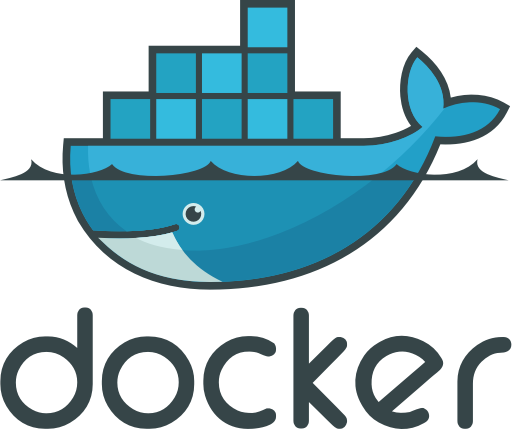

# Docker





## Docker 是什么

Docker is an open platform for developers and sysadmins to build, ship, and run distributed applications....

Docker 是一个开源的应用容器引擎，让开发者可以打包他们的应用以及依赖包到一个可移植的容器中，然后发布到任何流行的 Linux 机器上，也可以实现虚拟化。容器是完全使用沙箱机制，相互之间不会有任何接口（类似 iPhone 的 app）。几乎没有性能开销,可以很容易地在机器和数据中心中运行。最重要的是,他们不依赖于任何语言、框架或包装系统。


<br>

## 从 Application Runtime 来看 Docker

我们知道，一个应用能执行，需要底层的运行时。运行时的创建（迁移）有几下几个层级（上轻下重）：

举例来说一个 Java Web App，如果我们想进行迁移，有以下几种方案：

- 抱着机器从一个机房到另一个机房
- 用虚拟机的方案，把一个虚拟机的文件从一个机房传到另一个机房
- 重新构建一个应用运行时，也就是在操作系统上装上 Java，把代码重新部署启动


```
- Operating system
- Virtual machine
- Physical device
```


> 记得当时 Hyper-V 出来时，团队很兴奋，把服务器的资源都给改造了一次，不同的环境也能快速构建出标准。

从重到轻，这个单一维度上，我们可以发现，从物理机器到完整系统，迁移的成本在变低，复用的能力在变得更高。

虚拟机就是这样的例子，但它也存在问题，虚拟机里是完整的操作系统，这依然不利于迁移和复制，同时，虚拟机本身也占用太多的系统资源。

于是就有了容器，它再次创新了这个维度的极限。


<br />

## 特性

### 轻量

容器直接利用操作系统本身的能力，节省资源，而Docker 的镜像真的很小，启动后占用内存小。这可以保证很高的资源利用率。

### 分层

可以根据需求来进行分层构建镜像，传输时只传输那些变化的层级。可最大化的复用。

### 快速

启动速度非常快，不用启动一个完整的操作系统。

### 隔离

容器也和VM一样具有着一定的隔离性，各个容器之间的数据和内存空间相互隔离，可以保证安全性。


