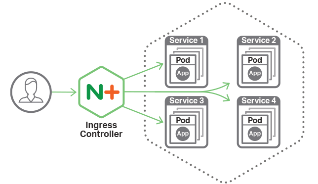

# Ingress



Kubernetes 提供了一种 HTTP 方式的路由转发机制，称为 Ingress。

```
internet
    |
[ Ingress ]
--|-----|--
[ Services ]
```


Ingress 的实现需要两个组件支持，Ingress Contriller 和 HTTP 代理服务器。HTTP 代理服务器将会转发外部的 HTTP 请求到 Service，而 Ingress Controller 则需要监控 Kubernetes API，实时更新 HTTP 代理服务器的转发规则。


## Proxy Server

这里我们有很多选择，像知名的 Nginx，或者是新晋的 Traefik。

它们不同的地方是 Nginx 是一个更独立的代理服务器，它和 Kubernetes 没有关联，所以需要一个单独的工具，来响应 apiserver，并修改代理服务器配置。而 Traefik 较新，本身集成了这部分功能，更加便捷。


### 配置 Proxy Server

以 Traefik 举例，我们通过容器来启动一个服务，Kubernetes 启动服务有很多种方式，普通的 Deployment 或者是 DeamonSet。

- [Traefik DeamonSet Mode](https://github.com/containous/traefik/blob/master/examples/k8s/traefik-ds.yaml)


<br />

## Ingress Controller


### Ingress Controller 和 HTTP 代理服务器是作为外部组件运行的。

前部分我们讲到代理服务器和 Kubernetes 结合工作时，需要由专门的工具来配合动态更新代理服务器的转发策略，外部通过 HTTP 代理服务器就可以访问到 Service。这部分被抽像出来，叫做 Ingress Controller。

不同的代理服务器有不同的 Ingress Controller。和其它类型的 Ingress Controller 与其他作为 kube-controller-manager 中的在集群创建时自动启动的 controller 成员不同，这个 Controller 不是作为集群初始化安装的，它不是集群必须要使用的，通过 Add-on 的型式可以进行后期安装，根据使用不同的代理服务器而选择不同的 Ingress Controller。

- NGINX Ingress Controller https://github.com/kubernetes/ingress-nginx
- traefik Traefik 内建一个 Ingress Controller，不需要单独安装


Ingress Controller 以 Kubernetes Pod 的方式部署，以 daemon 方式运行，保持 watch Apiserver 的 /ingress 接口以更新 Ingress 资源，以满足 Ingress 的请求.


<br />

## Ingress Resource

接下来，我们为代理服务器配置上加入一些规则，让请求能到达正确的服务上。

Ingress 定义中的 .spec.rules 设置了转发规则，启用配置了一条规则，当 HTTP 请求的 host 为 my.example.com 且 path 为/app 时，转发到 Service my-app 的 80 端口。


### SEPC

创建一个 Ingress，来实际说明一下：

``` yaml my-ingress.yaml
apiVersion: extensions/v1beta1
kind: Ingress
metadata:
  name: my-ingress
spec:
  rules:
  - host: ingress.example.com
    http:
      paths:
      - path: /app
      backend:
        serviceName: my-app
        servicePort: 80
```

Ingress 完成后，就会在代理服务器上生成一条规则， `ingress.example.com` 的请求会被转发到 `my-app` 的服务的 80 端口上。


<br>

## QA

### TLS 为 Proxy 配置 SSL

>TBD


<br>

## REF::

- https://mritd.me/2017/03/04/how-to-use-nginx-ingress/

- [images1](https://cdn-1.wp.nginx.com/wp-content/uploads/2017/09/NGINX-Plus-Features-Kubernetes-Ingress-Controller-644x372@2x.png)


