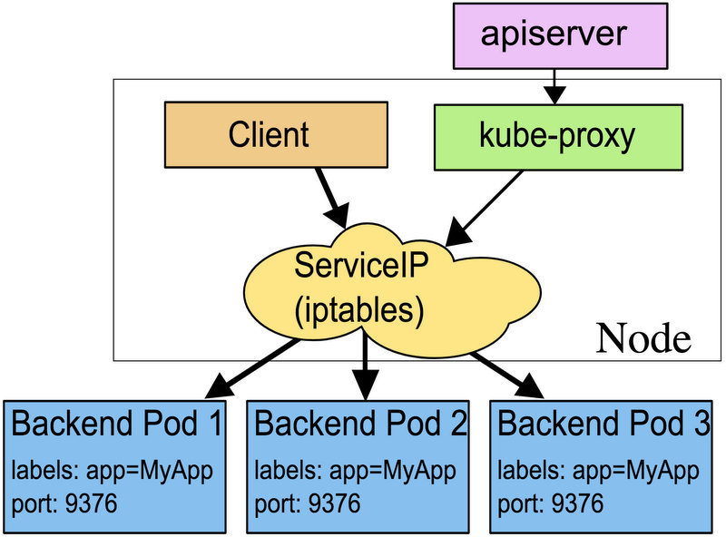

# Kube-proxy 入门


kube-proxy 监听 API server 中 service 和 endpoint 的变化情况，并通过 userspace、iptables、ipvs 或 winuserspace 等 proxy 来为服务配置负载均衡。

kube-proxy 有多种方式，

- userspace 模式
- iptables 模式, （1.2 版本成为默认）
- ipvs 1.8.0 版本加入


## iptables

kube-proxy 在每一台 Node 上运行，它的作用就是从 master 上拿到集群的信息，然后更新自身操作系统 iptables/netfilters 的 NAT 转发，从而控制网络的流转，从而实现代理和负载均衡的功能。




``` yaml
apiVersion: v1
kind: Service
metadata:
  labels:
    name: mysql
    role: service
  name: mysql-service
spec:
  ports:
    - port: 3306
      targetPort: 3306
      nodePort: 30964
  type: NodePort
  selector:
    mysql-service: "true"
```

一个 Service 创建好之后，会生成对应的 Cluster IP 和服务的端口。

kube-proxy 会生成该 Service, Pod 的 iptables Rule，将 Service 的 VIP 请求转发到 多个 Pod IP 上。

这样，再当一个到 Service Cluster IP (VIP) 上的请求发生时，就会被 iptables 进行匹配，通过 Rubin 算法，分配给一台具体 Pod 的 IP 上。

从而实现代理，Robbin 算法则是负载均衡的模式。


