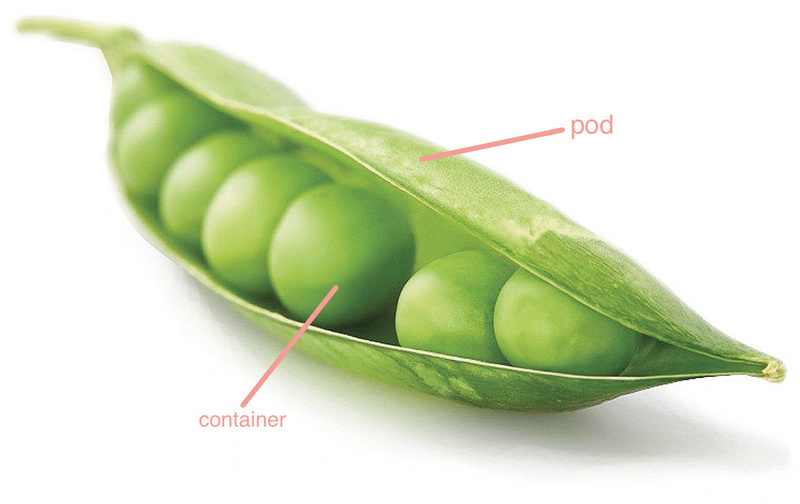

# Pod

Pod 是 Kubernetes的基本操作单元，把相关的一个或多个容器构成一个Pod，通常Pod里的容器运行相同的应用。Pod包含的容器运行在同一个Node(Host)上，看作一个统一管理单元，共享相同的volumes和network namespace/IP和Port空间。

在 Kubernetes 中，使用的最小单位是容器组，容器组是创建，调度，管理的最小单位。 一个容器组使用相同的Dokcer容器并共享卷（挂载点）。一个容器组是一个特定运用的打包集合，包含一个或多个容器。

和运行的容器类似，一个容器组被认为只有很短的运行周期。容器组被调度到一组节点运行，知道容器的生命周期结束或者其被删除。如果节点死掉，运行在其上的容器组将会被删除而不是重新调度。（也许在将来的版本中会添加容器组的移动）。



这张图是介绍 Pod 最好的比喻了。


### 容器组设计的初衷：

* 资源共享和通信
* 容器组主要是为了数据共享和它们之间的通信。
* 在一个容器组中，容器都使用相同的网络地址和端口，可以通过本地网络来相互通信。每个容器组都有独立的ip，可用通过网络来和其他物理主机或者容器通信。
* 容器组有一组存储卷（挂载点），主要是为了让容器在重启之后可以不丢失数据。


### 容器组管理：

容器组是一个运用管理和部署的高层次抽象，同时也是一组容器的接口。容器组是部署、水平放缩的最小单位。


### 容器组的使用：

容器组可以通过组合来构建复杂的运用，其本来的意义包含：

* 内容管理，文件和数据加载以及本地缓存管理等。
* 日志和检查点备份，压缩，快照等。
* 监听数据变化，跟踪日志，日志和监控代理，消息发布等。
* 代理，网桥
* 控制器，管理，配置以及更新


### 替代方案：

为什么不在一个单一的容器里运行多个程序？

* 透明化。为了使容器组中的容器保持一致的基础设施和服务，比如进程管理和资源监控。这样设计是为了用户的便利性。
* 解偶软件之间的依赖。每个容器都可能重新构建和发布，Kubernetes必须支持热发布和热更新（将来）。
* 方便使用。用户不必运行独立的程序管理，也不用担心每个运用程序的退出状态。
* 高效。考虑到基础设施有更多的职责，容器必须要轻量化。


### Spec

``` yaml
apiVersion: v1
kind: Pod
metadata:
  name: gluster-pod1
  labels:
    name: gluster-pod1
spec:
  containers:
  - name: gluster-pod1
    image: nginx:1.13.5-alpine
    ports:
    - name: web
      containerPort: 80
    securityContext:
      privileged: true
```


