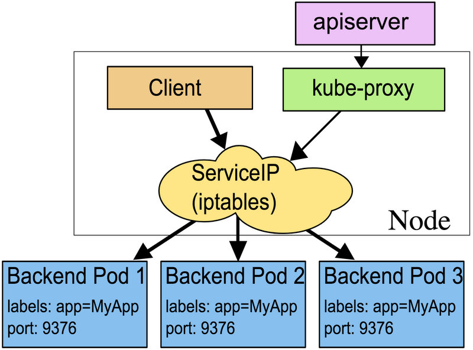

# Service 的概念

Service 是整个体系中最重要的概念之一，但它也相对于比较难于理解，因为它只是一个概念，而不存在一个实体。

在上一章 [Pod](pod.md) 中，我们为了解决 Pod 对外提供服务的问题，提到了使用 Service 来做代理和负载均衡。也就是所有的请求都会到 Service，然后再分配给具体的 Pod 去执行。


<br />

## 如何运行

在理解 Service 之前，需要先普及下 Kubernetes 的网络，在整个集群中，机器和机器是相互联通的。通过另一层虚拟网络，Kubernetes 让集群中所有东西可互通。这包括了 Pod 和 Pod 之间（跨主机），Pod 和主机之间（跨主机）。

理解完 k8s 的网络后，再看下 Service 的实现机制，它是由 kube-proxy 来完成的，kube-proxy 从 apiserver 上取下 Pod 的信息，然后更新自己所在主机的 Linux iptables 规则。Service 是一个通过 iptables 创建出来的 Virtual IP。

所有的主机都执行相同的操作，这个 VIP 也在所有的主机上都存在。

当一个请求从一台机器访问到这个 Servcie 的 VIP 上，它直接该主机上的 iptables 进行了转发，通过轮询算法，被分发到任意一台 Pod 上，因为 Kubernetes 网络的特性，Pod 可以是跨主机的。



以上就是 Service 实现反向代理和负载均衡的方式。


Service 是通过 Label 和 Selector 来知道要将请求代理到哪一个 Pod 上，关于 Label 和 Selector 请参考： [label](label.md)


<br />

## Kubernetes Service 对外发布 Service

Service 的虚拟 IP 依然是由 Kubernetes 虚拟出来的内部网络，外部网络是无法访问的，但是有一些 Service 有需要对外暴露，比如 Web 的前段。这时候就需要增加一层路由转发，即外网到内网的转发，Kubernetes 提供了 NodePort Service 、LoadBalancer Service 和 Ingress 进行 Service 的发布。


### NodePort Service

NodePort Service 是类型为 NodePort 的 Service，Kubernetes 出去会分配给 NodePort Service 一个内部虚拟IP，另外会在每一个 Node 上暴露端口 NodePort，外部网络可以通过 [NodeIP]:[NodePort] 访问到 Service。


#### NodePort SPEC

创建一个 NodePort Service nodeport-nginx-service.yaml：

``` yaml
apiVersion: v1
kind: Service
metadata:
  name: my-nginx
spec:
  type: NodePort
  selector:
    app: nginx
  ports:
  - name: http
    port: 80
    targetPort: 80
    #nodePort: 8081
    protocol: TCP
```

nodePort：可以固定端口，默认会从 30000~32000 端口随机开设。

 
- hostNetwork： 可以设置 Pod 默认级别，这支此选项后，hostPort默认等于 containerPort，Pod 上所有的 端口都被映射到 Node 上。
- hostPort：可以自定义端口到 node 上。


#### NodePort DESC


Kubernetes 给 NodePort Service 中每一个端口都创建了一个 NodePort （http 30433/TCP）,在 NodePort Service 定义中可以通过 ,spec.ports[].nodePort 指定固定 NodPort，NodePort 的范围默认是 30000 ~ 32767，可以通过 Kubernetes API Service 的启动参数 --service-node-port-range 指定范围。NodePort Service 就可以通过[NodeIP]:[NodePort] 访问,而当 NodeIP 是一个公网 IP 时，外部就可以访问到 NodePort Service 了。
 

### LoadBalancer Service

LoadBalancer 是由云服务器提供商进行提供，这里不再具体多讲。

LoadBalancer Service 是类型为 LoadBalancer 的 Service，LoadBalancer Service 是建立在 NodePort Service 集群上的，Kubernetes 会分配给 LoadBalancer Service 一个内部的虚拟 IP，并且暴露 NodePort。除此之外，Kubernetes 请求底层云平台创建一个负载均衡器，将每个 Node 作为后端，负载均衡器将会转发请求到 [NodeIP]:[NodePort]。

LoadBalancer Service 需要底层云平台支持创建负载均衡其，比如 GCE，现在创建一个 LoadBalancer Service， 

``` yaml loadbalancer-nginx-service.yaml :
apiVersion: v1
kind: Service
metadata:
  name: my-nginx
spec:
  selector:
    app: my-nginx
  ports:
  - name: http
    port: 80
    targetPort: 80
    protocol: TCP
  type: LoadBalancer
```
  
```
$ kubectl create -f loadbalancer-nginx-service.yaml
```

Kubernetes 会分配给 LoadBalancer Service 一个内部的虚拟 IP ，并暴露 NodePort。进一步的，Kubernetes 请求底层云平台创建一个负载均衡其，作为访问 LoadBalancer Service 的外部访问入口。 负载均衡器由底层云平台创建提供，会包含一个 LoadBalancerIP，可以认为是 LoadBalancer Service 的外部 IP，查询 LoadBalancer Service：

```
$ kubectl get svc my-nginx 
```

其中  EXTERNAL-IP：xx 就是  LoadBalancer Service 的外部 IP，负载均衡器将每一个 Node 作为后端，当请求 xxx 时，负载均衡器将转发请求到相应的 [NodeIP]:[NodePort] ，从而访问到  LoadBalancer Service 。


## Ingress

NodePort 的方式很简单，但对于更多的对外服务则不是很方便，需要大量的人工设置，于是 Kubernets 1.4 版本中引入了 Ingress，一种 HTTP 方式的路由转发机制。

Ingress 的实现需要两个组件支持，Ingress Contriller 和 HTTP 代理服务器。HTTP 代理服务器将会转发外部的 HTTP 请求到 Service，而 Ingress Controller 则需要监控 Kubernetes API，实时更新 HTTP 代理服务器的转发规则。

Ingress 我们在下一章单独来讲解：[Ingress](ingress.md)


<br />

## REF / 参考：

